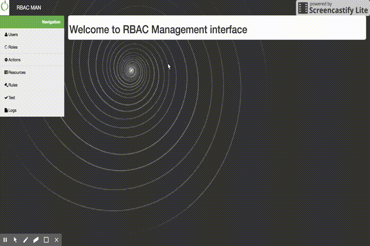

rbac-man
========

This project provides an implementation of the PEP/PDP/PIP/PAP access control pattern. The implementation is in Java. For the moment it implements an XACML PDP. It provides a web based user interface to manage users, roles, actions, assign actions to roles, and assign users to roles.

Architecture
------------

Interface
---------

rbac-man offers a management interface with CRUD operations on its entities (user, rule, actions, ...), rule testing and logs.

Sequence diagram
----------------

Secure Logger
-------------

### Log ontology

Notes
-----

Draw.io sources can be found in doc/ folder
